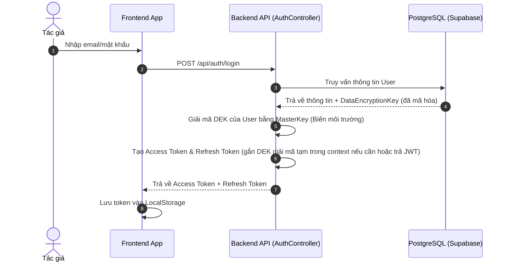
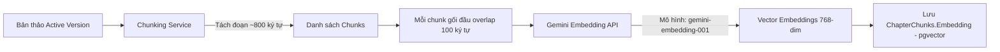
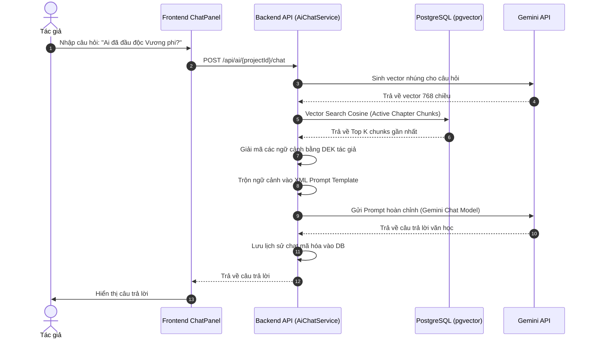
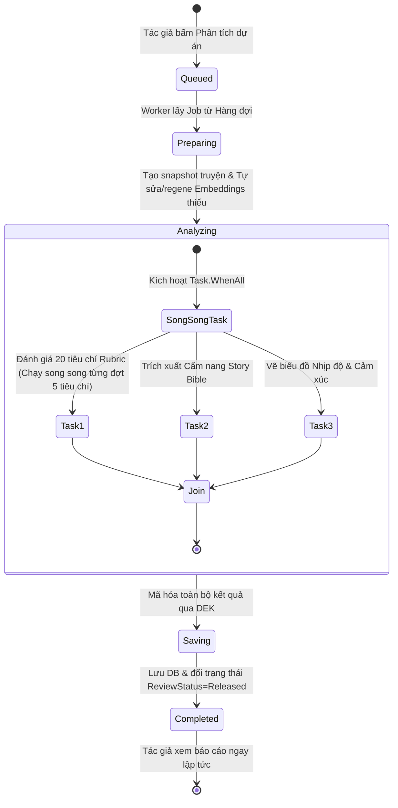
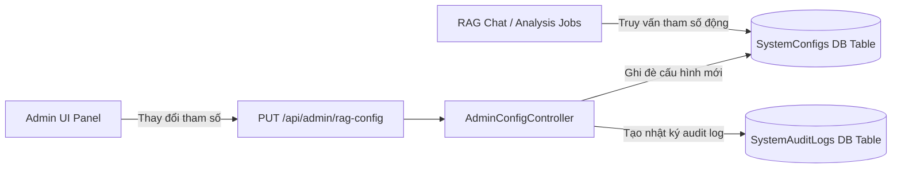
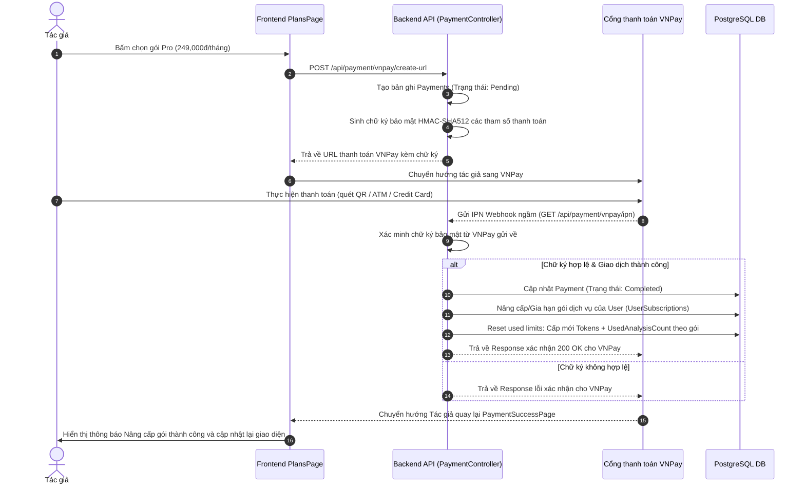

# 📋 Tài liệu Chi tiết Luồng Hoạt động và Chức năng Hệ thống (System Flows) — StoryRAG

Tài liệu này mô tả chi tiết, chuyên sâu các luồng hoạt động (Data & Workflow Pipelines) và các nhóm chức năng chính trong hệ thống **StoryRAG** (tên thương mại **StoryNest**). Tài liệu tích hợp các sơ đồ **Mermaid Diagram** giúp trực quan hóa kiến trúc luồng dữ liệu từ Frontend (React Client) qua các lớp API, Services, Cơ sở dữ liệu và AI Engine (Gemini API).

---

## 🗂️ Mục lục các Luồng Nghiệp vụ
1. [Luồng Xác thực & Bảo mật Mã hóa Đầu cuối (E2E Encryption & Auth)](#1-luồng-xác-thực--bảo-mật-mã-hóa-đầu-cuối-e2e-encryption--auth)
2. [Luồng Trình soạn thảo & Tự động lưu (Autosave & Version Control)](#2-luồng-trình-soạn-thảo--tự-động-lưu-autosave--version-control)
3. [Luồng Nhúng dữ liệu & RAG Chunks (Embedding & Chunking Pipeline)](#3-luồng-nhúng-dữ-liệu--rag-chunks-embedding--chunking-pipeline)
4. [Luồng RAG Chatbot & Hỗ trợ Viết (RAG Chat & AI Writing Assistants)](#4-luồng-rag-chatbot--hỗ-trợ-viết-rag-chat--ai-writing-assistants)
5. [Luồng Đánh giá Dự án & Rubric 100 điểm (Async Job Worker & Parallel Rubrics)](#5-luồng-đánh-giá-dự-án--rubric-100-điểm-async-job-worker--parallel-rubrics)
6. [Luồng Cấu hình Cổng kiểm soát cho Admin (Admin RAG Configuration)](#6-luồng-cấu-hình-cổng-kiểm-soát-cho-admin-admin-rag-configuration)
7. [Luồng Nâng cấp Gói & Thanh toán VNPay (VNPay Integration & Subscription Lifecycle)](#7-luồng-nâng-cấp-gói--thanh-toán-vnpay-vnpay-integration--subscription-lifecycle)
8. [Luồng Hậu kiểm & Phản hồi chuyên môn của Staff (Staff Post-Audit & Wide Reader Modal)](#8-luồng-hậu-kiểm--phản-hồi-chuyên-môn-của-staff-staff-post-audit--wide-reader-modal)
9. [Luồng Dọn dẹp dữ liệu & Xóa mềm (Pruning & Soft/Hard Deletion)](#9-luồng-dọn-dẹp-dữ-liệu--xóa-mềm-pruning--softhard-deletion)

---

## 1. Luồng Xác thực & Bảo mật Mã hóa Đầu cuối (E2E Encryption & Auth)

**Mục tiêu:** Đảm bảo dữ liệu bản thảo truyện của tác giả được mã hóa an toàn tuyệt đối ngay tại DB PostgreSQL bằng AES-256 cá nhân hóa.

### Sơ đồ Luồng Đăng nhập & Tạo Khóa DEK


### Chi tiết các bước:
1. **Đăng ký tài khoản:** 
   - `AuthController.Register` nhận thông tin, sinh ngẫu nhiên một **Data Encryption Key (DEK)** dài 256-bit dành riêng cho user đó.
   - DEK được mã hóa bằng thuật toán đối xứng sử dụng `Security:MasterKey` được định cấu hình tại môi trường hệ thống.
   - Dữ liệu DEK đã mã hóa được lưu vào cột `DataEncryptionKey` của bảng `Users`.
2. **Xác thực JWT:**
   - Client đính kèm `Authorization: Bearer <token>` vào mọi yêu cầu.
   - **Xoay vòng Token:** Khi token hết hạn (401), Axios Interceptor tự động tạm dừng hàng đợi, gọi `POST /api/auth/refresh` bằng Refresh Token để lấy cặp token mới rồi tự động thực thi lại các request lỗi mà người dùng không hề nhận biết (Seamless UX).
3. **Mã hóa E2E tại Service Layer:**
   - Mọi thực thể chứa bản thảo (`Chapters`, `ChapterVersions`, `ChatMessages`) trước khi chèn vào Database đều đi qua lớp lọc `EncryptionHelper.EncryptWithUserKey`.
   - Khi đọc lên, service lấy DEK của chính tác giả đó, giải mã (`DecryptWithUserKey`) rồi mới gửi kết quả sạch về cho Frontend render. Nhân viên quản trị hệ thống nếu truy cập DB trực tiếp cũng chỉ thấy các chuỗi ký tự Hex mã hóa vô nghĩa.

---

## 2. Luồng Trình soạn thảo & Tự động lưu (Autosave & Version Control)

**Mục tiêu:** Cung cấp trải nghiệm soạn thảo mượt mà, tự động sao lưu tránh mất mát dữ liệu và cho phép ghim (pin), khôi phục phiên bản lịch sử kiểu Git.

### Sơ đồ luồng Autosave
```mermaid
graph TD
    A[Tác giả gõ chữ trên Editor] -->|Thay đổi nội dung| B(Kích hoạt Debounce 4 giây)
    B -->|Hết thời gian chờ| C[Frontend gọi: PUT /api/projects/{id}/chapters/{cid}]
    C --> D[Backend Service: Giải mã DEK tác giả]
    D --> E[Mã hóa nội dung chương mới bằng DEK]
    E --> F[Cập nhật Active Version + Word Count + Token Count]
    F --> G[Đặt trạng thái: IsChunked=false, IsEmbedded=false]
    G --> H[Lưu PostgreSQL]
    H --> I[Tự động đưa vào hàng đợi Auto-Embedding]
```

### Chi tiết các chức năng nâng cao:
*   **Autosave Debounce:** Hạn chế số lượng request dồn dập lên Server. Mỗi thao tác phím sẽ reset bộ đếm thời gian 4 giây.
*   **Quản lý Version (Git-style):**
    *   **Tạo Phiên bản mới:** Tác giả bấm "Tạo mốc phiên bản" -> Backend nhân bản bản ghi hiện tại thành một bản ghi `ChapterVersions` mới có số phiên bản (`VersionNumber`) tăng dần.
    *   **Toggle Ghim (Pin Version):** Mặc định hệ thống tự động dọn dẹp các version quá cũ khi vượt quá 20 phiên bản/chương. Tác giả ghim phiên bản (`IsPinned = true`) sẽ bảo vệ phiên bản đó không bao giờ bị dọn dẹp tự động.
    *   **Diff & So sánh:** FE gọi `GET /compare?v1=1&v2=2`, Backend lấy nội dung 2 phiên bản, giải mã, thực hiện giải thuật so sánh văn bản từng dòng và trả về mảng Diff (Additions/Deletions) trực quan hóa trên giao diện.

---

## 3. Luồng Nhúng dữ liệu & RAG Chunks (Embedding & Chunking Pipeline)

**Mục tiêu:** Chuyển đổi văn bản bản thảo thô thành các vector toán học 768 chiều để máy tính hiểu được ngữ cảnh.



### Các bước hoạt động chi tiết:
1. **Trigger:** Tác giả nhấn lưu thủ công, hoặc hệ thống kết thúc thời gian chờ lưu tự động -> kích hoạt chạy ngầm RAG processing.
2. **Chia nhỏ văn bản (Chunking):**
   - Đọc kích thước chunk từ cấu hình Admin (`rag.chunk_size`, mặc định 800 ký tự).
   - Đọc độ gối đầu từ `rag.chunk_overlap` (mặc định 100 ký tự để không mất ngữ cảnh ở biên của chunk).
   - Tách văn bản dựa theo dấu xuống dòng hoặc dấu chấm câu gần nhất để tránh cắt đôi câu văn.
3. **Gọi AI sinh nhúng (Embedding Generation):**
   - Backend sử dụng `IEmbeddingService` gọi API Gemini để tính toán vector đại diện.
   - Vector 768 chiều được lưu trực tiếp vào bảng `ChapterChunks` trong PostgreSQL.
   - Đánh dấu phiên bản chương `IsEmbedded = true`.

---

## 4. Luồng RAG Chatbot & Hỗ trợ Viết (RAG Chat & AI Writing Assistants)

**Mục tiêu:** Tác giả có thể hỏi đáp với AI về mọi tình tiết trong tác phẩm và sử dụng AI để mở rộng mạch văn mà không bị ảo tưởng (Hallucination).

### Sơ đồ luồng RAG Chat


### Nhóm chức năng AI Writing hỗ trợ trực tiếp trong Editor:
*   **AI Rewrite (Viết lại):** Bôi đen đoạn văn -> Chọn tông giọng (Lãng mạn, U tối, Dồn dập...) -> AI chỉnh sửa câu chữ phù hợp.
*   **AI Continue Writing (Viết tiếp):** AI đọc 1500 ký tự gần nhất quanh con trỏ chuột, phân tích văn phong và tự động viết thêm 300-500 từ theo đúng mạch cảm xúc của tác giả.
*   **Scene & Cliffhanger Panel:** AI quét toàn bộ chương để bóc tách các cảnh, trích xuất câu hội thoại đắt giá tạo highlight nhấp nháy trên editor, đồng thời chấm điểm "Cliffhanger" (nút thắt kịch tính cuối chương) xem có đủ sức giữ chân người đọc không.

---

## 5. Luồng Đánh giá Dự án & Rubric 100 điểm (Async Job Worker & Parallel Rubrics)

**Mục tiêu:** Chấm điểm toàn bộ tác phẩm theo Rubric 20 tiêu chí độc quyền, phát hiện cờ cảnh báo chất lượng và nội dung nhạy cảm một cách nhanh chóng qua cơ chế đa luồng chạy song song.

### Sơ đồ Luồng Async Job Worker & Task Parallelism


### Các bước hoạt động chi tiết:
1. **Gửi Job:** Frontend gọi `POST /api/ai/{projectId}/analyze/jobs`. Job được đẩy vào hàng đợi ngầm `AnalysisJobQueue` (sử dụng .NET `System.Threading.Channels`). Server trả ngay `202 Accepted` kèm theo `JobId`.
2. **Xử lý ngầm (Background Worker):** `ProjectAnalysisJobWorker` bắt đầu xử lý:
   - **Tự sửa lỗi dữ liệu (Data Self-Repair):** Quét toàn bộ bản thảo trong snapshot truyện, phát hiện chương nào chưa chunk/embed đầy đủ sẽ tự động thực hiện chunking và embedding trước khi gửi sang RAG.
3. **Phân tích Đa luồng song song (Task Parallelism):**
   - **RAG Stage 1:** Đọc từng lô chunks bản thảo (`rag.stage1_batch_chunks`), gọi AI trích xuất các facts thô về nhân vật, cốt truyện và lỗi logic kịch bản.
   - **Trích xuất Cẩm nang truyện (Story Bible Extraction - Task 2):** Đọc **toàn bộ 100% nội dung bản thảo đã giải mã** (`decryptedChunks`) và truyền trực tiếp sang Gemini API trong `{textContext}`. Cơ chế này loại bỏ hoàn toàn việc lấy mẫu (sampling) các phần đầu/giữa/cuối, đảm bảo AI tiếp cận toàn diện toàn bộ tác phẩm để lập hồ sơ nhân vật, bối cảnh thế giới, dòng thời gian và chủ đề một cách chi tiết và chính xác nhất.
   - **RAG Stage 2 (Rubric Judgment - Mô hình Critic-Coach & Cẩm nang lỗi đặc thù):**
     * Hệ thống đọc cấu hình `rag.rubric_batch_size` (mặc định song song **5 tiêu chí Rubric mỗi đợt**) để chấm điểm.
     * **Cẩm nang lỗi đặc thù (Rubric Flaw Hunt List)**: Mỗi tiêu chí được tiêm động một bộ hướng dẫn phát hiện lỗi văn học chuyên sâu (ví dụ: Mary Sue ở mục nhân vật, Deus Ex Machina ở mục cốt truyện, Tell-don't-show và Cliches ở mục văn phong).
     * **Mô hình Đánh giá Kép (Critic-Coach Prompting)**: 
       - *errors (Critic)*: Vạch trần chính xác lỗi kèm trích dẫn thực tế và chương cụ thể.
       - *suggestions (Coach)*: Bắt buộc cung cấp **phương án viết lại mẫu (Example Rewrite)** trực quan sinh động thay vì lời khuyên chung chung.
4. **Phát hiện 7 Cảnh báo Đặc biệt (Warnings Framework):**
   - AI quét sâu dòng sự kiện để cắm cờ các lỗi hoặc nội dung nhạy cảm:
     *   `ANTI_STATE` (Critical) - Các chi tiết xuyên tạc lịch sử, phản động.
     *   `SEXUAL_CONTENT` (Warning/Critical) - Cảnh tả quan hệ tình dục trần trụi, thô tục.
     *   `PLAGIARISM_RISK` (Critical) - Trùng lặp ý tưởng lớn hoặc sao chép văn phong.
     *   `INCOMPLETE` (Warning) - Truyện bị dừng đột ngột, thiếu chương kết thúc.
     *   `INCONSISTENCY` (Info/Warning) - Mâu thuẫn thiết lập logic (ví dụ nhân vật đã chết bỗng nhiên sống lại).
     *   `REPETITION` (Warning) - Copy paste, lặp đoạn văn văn học.
     *   `SPELLING_FORMATTING` (Warning) - Quét tỉ mỉ lỗi chính tả, gõ phím tiếng Việt, khoảng trắng kép và chỉ rõ vị trí chương mắc lỗi.
5. **Auto-Repair RAG trích dẫn & Mở rộng bối cảnh (RAG Quote Matching & Context Expansion):**
   - **Sửa lỗi lệch chương**: Thực hiện quét so khớp trực tiếp chuỗi ký tự (literal match) của trích dẫn `evidence` mà AI trả về trên toàn bộ các chunk đã giải mã trên RAM ở Backend. Nếu phát hiện phân đoạn thực sự chứa trích dẫn đó, hệ thống ưu tiên gán đúng id chunk của chương chứa trích dẫn, triệt tiêu lỗi lệch chương.
   - **Mở rộng ngữ cảnh (Context Expansion)**: Khi trả về minh chứng của một chunk `i`, hệ thống tự động ghép thêm nội dung của chunk liền trước (`i - 1`) và liền sau (`i + 1`) của cùng chương và phiên bản, bảo vệ trích dẫn không bao giờ bị cắt cụt câu văn ở biên phân đoạn.
6. **Vẽ biểu đồ Nhịp độ & Cảm xúc (Narrative Analytics - Task 3):**
   - **Chế độ Toàn Cảnh (Overview - Theo Chương)**: Tự động tính điểm trung bình của từng chương, giúp vẽ biểu đồ phẳng đẹp, dễ theo dõi kịch tính vĩ mô không bị quá tải khi truyện có quy mô lớn (20+ chương).
   - **Chế độ Chi Tiết Chương (Detail - Theo Phân đoạn)**: Chọn xem cụ thể một chương và chỉ vẽ biểu đồ các đoạn văn của riêng chương đó kết hợp với hộp đối chứng nội dung truyện khi nhấp điểm.
   - **Thẩm mỹ Đồ họa**: Vẽ bằng đường cong mềm mại (cubic bezier curve), tích hợp SVG Dynamic Tooltips bám theo con trỏ chuột và vertical crosshairs khi hover.
   - **Phân tích AI đa chiều**: Tự động bóc tách các nhận định AI và hiển thị dạng 4 thẻ Glassmorphic kính mờ sang trọng đại diện cho: ⚡ Nhịp độ, 🎭 Cảm xúc, 👥 Nhân vật, 💡 Đề xuất chỉnh sửa kịch bản.
7. **Auto-Release:** Sau khi lưu thành công kết quả mã hóa DEK vào bảng `ProjectReports`, trạng thái được đặt thẳng thành `Released` để tác giả có thể xem ngay trên UI mà không cần chờ Staff duyệt.
6. **Xử lý lỗi và Cơ chế Chạy lại (Error Isolation & Rerun):**
   - **Bảo vệ Trải nghiệm Tác giả (Error Masking):** Nếu quá trình phân tích ngầm gặp lỗi (lỗi API Gemini, tràn quota, hoặc lỗi logic), hệ thống tự động bắt exception. Để đảm bảo trải nghiệm chuyên nghiệp và bảo mật thông tin kỹ thuật, hệ thống **chỉ hiển thị thông báo chung** `"Phân tích thất bại. Vui lòng thử lại."` trên giao diện tác giả và hộp thư thông báo của họ, hoàn toàn che giấu (mask) các chi tiết exception trace phức tạp.
   - **Quyền Chạy lại của Tác giả (User Rerun Right):** Khi phân tích thất bại, giao diện tác giả không bị khóa. Hệ thống hiển thị trực quan nút **"Chạy lại"** ngay bên trong Alert báo lỗi để tác giả lập tức kích hoạt phân tích mới.
   - **Giám sát của Ban kiểm duyệt (Staff Oversight):** Mặc dù ẩn đối với tác giả, nhưng **toàn bộ chi tiết lỗi kỹ thuật đầy đủ** đều được lưu trữ nguyên vẹn trong cơ sở dữ liệu (`ErrorMessage`) và đồng bộ lên trang điều hành lỗi của Staff (`/api/staff/analysis-jobs?status=failed`) để đội ngũ kỹ thuật và Staff nhanh chóng theo dõi, debug và hỗ trợ.

---

## 6. Luồng Cấu hình Cổng kiểm soát cho Admin (Admin RAG Configuration)

**Mục tiêu:** Cung cấp cho Admin công cụ kiểm soát, tối ưu hóa chi phí AI token và phòng ngừa lỗi nghẽn hoặc tràn RPM.



### Ý nghĩa các tham số kiểm soát động:
*   `rag.chunk_size` & `rag.chunk_overlap`: Điều khiển mật độ nén thông tin khi băm văn bản.
*   `rag.top_k_chat` & `rag.top_k_report`: Số lượng mảnh dữ liệu truy hồi. Basic/Pro sẽ được cấu hình Top-K lớn hơn để AI trả lời chi tiết và bao quát hơn.
*   `rag.stage1_batch_chunks`: Số lượng chunks xử lý đồng thời trong Stage 1 để bóc tách dữ kiện.
*   `rag.rubric_batch_size`: Số tiêu chí rubric chạy song song mỗi lượt (mặc định: 5).
*   `gemini.analyze_rpm_limit`: Điều phối tần suất gọi API Gemini, tránh lỗi tràn băng thông và lỗi 429 khi hàng loạt tác giả bấm phân tích cùng lúc.

---

## 7. Luồng Nâng cấp Gói & Thanh toán VNPay (VNPay Integration & Subscription Lifecycle)

**Mục tiêu:** Tự động hóa hoàn toàn quy trình kinh doanh SaaS, nâng cấp gói và gia hạn hạn mức sử dụng AI cho tác giả thông qua cổng VNPay.

### Sơ đồ Luồng thanh toán VNPay


---

## 8. Luồng Hậu kiểm & Phản hồi chuyên môn của Staff (Staff Post-Audit & Wide Reader Modal)

**Mục tiêu:** Cho phép nhân viên biên tập (Staff) giám sát chất lượng, hậu kiểm các bản thảo bị cờ cảnh báo vi phạm pháp luật/chính sách và phản hồi chuyên môn cho tác giả.

### Các chức năng đặc thù:
1.  **Staff Flagged Portal (`/api/staff/manuscripts/flagged`):** Hệ thống tự động đẩy các bản thảo bị cắm cờ cảnh báo (theo thứ tự ưu tiên: `ANTI_STATE` -> `SEXUAL_CONTENT` -> `PLAGIARISM_RISK` -> `INCOMPLETE_STORY` -> `INCONSISTENCY_DETECTED` -> `LOW_QUALITY_SCORE`) vào màn hình giám sát của Staff để xử lý.
2.  **Wide Reader Modal (Trình đọc so sánh):**
    - Staff mở trình đọc chuyên dụng hỗ trợ 3 giao diện hiển thị (Dark, Sepia, Light), các bộ tinh chỉnh font chữ và cỡ chữ.
    - Bản thảo hiển thị ở chế độ **Chỉ đọc (Read-only)** để nhân viên đối chiếu trực tiếp nội dung nguyên bản của tác giả với các nhận xét và cảnh báo của AI nhằm đưa ra quyết định chính xác.
3.  **Hành động của Staff (`POST /api/staff/analyses/{reportId}/review`):**
    *   **Adjust (Điều chỉnh):** Staff trực tiếp chỉnh sửa điểm số tiêu chí hoặc nội dung nhận xét của AI qua API `/analyses/{reportId}/edit` trước khi gửi tới tác giả để đảm bảo tính chuyên nghiệp.
    *   **RerunRequested (Yêu cầu chạy lại):** Nếu phát hiện lỗi phân tích hoặc lỗi dữ liệu bản thảo, Staff có thể yêu cầu worker chạy lại job phân tích AI hoàn toàn mới.
    *   **Staff Feedback Loop (Phản hồi chuyên môn):** Staff có thể gửi phản hồi trực tiếp cho tác giả. Tác giả nhận được thông báo thời gian thực trên thanh tiêu đề, có thể bấm Thích/Không thích (Like/Dislike) và Phản hồi (Reply) trực tiếp để trao đổi sâu hơn với nhân viên biên tập chuyên nghiệp.

---

---

## 9. Luồng Dọn dẹp dữ liệu & Xóa mềm (Pruning & Soft/Hard Deletion)

**Mục tiêu:** Quản lý dung lượng lưu trữ cơ sở dữ liệu vector và bảo mật quyền lãng quên của người dùng.

### So sánh hai cơ chế xóa:
| Đặc tính | Xóa mềm (Soft Delete) | Xóa cứng (Hard Delete) |
|---|---|---|
| **Áp dụng cho** | `Projects` (Dự án truyện) | `Chapters` (Chương), `ChapterVersions` (Phiên bản chương) |
| **Cách hoạt động** | Cập nhật cờ hiệu `IsDeleted = true`. | Gọi lệnh `.RemoveRange()` xóa trực tiếp bản ghi khỏi DB. |
| **Dữ liệu Vector** | Vẫn được giữ lại phục vụ phục hồi dự án. | Quét sạch toàn bộ dữ liệu nhúng liên quan trong bảng `ChapterChunks` (Cascade delete). |
| **Phục hồi** | Có thể phục hồi thông qua can thiệp quản trị viên. | Không thể khôi phục. Tránh hiện tượng rác dữ liệu làm nhiễu ngữ cảnh truy hồi RAG. |

*   **Cơ chế Auto-Pruning Lịch sử (Pruning):** Hệ thống giới hạn tối đa 20 phiên bản cho mỗi chương truyện. Khi người dùng tạo phiên bản thứ 21, background job sẽ tự động tìm kiếm phiên bản cũ nhất **không được ghim** (`IsPinned = false`), xóa cứng phiên bản đó kèm toàn bộ các chunks vector liên quan trong bảng `ChapterChunks` để tối ưu hóa không gian lưu trữ.

---
*Tài liệu này là đặc tả kỹ thuật chi tiết nhất về các luồng hoạt động nghiệp vụ trong hệ thống StoryRAG.*
