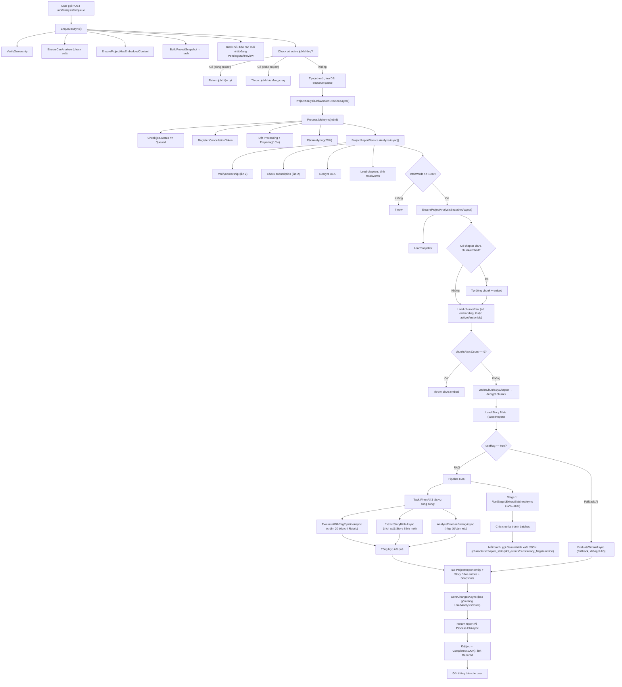

# Kiểm tra Logic Phân Tích Truyện — Từ Đầu đến Cuối

## Luồng tổng quát



---

## Phân tích Chi tiết từng Bước

### 1. `EnqueueAsync` — [ProjectAnalysisJobService.cs](file:///c:/Users/admin/Downloads/Projects/StoryRAG/Backend/Service/Implementations/ProjectAnalysisJobService.cs#L73-L179)

| Bước | Mô tả | Vấn đề tiềm ẩn |
|------|--------|----------------|
| `VerifyOwnershipAsync` | Kiểm tra project thuộc user | ✅ OK |
| `EnsureCanAnalyzeAsync` | Kiểm tra subscription active + còn lượt | ✅ OK |
| `EnsureProjectHasEmbeddedContentAsync` | Chỉ kiểm tra có chapter có `CurrentVersionId`. **Không** bắt buộc đã embed | ⚠️ Không chặn trường hợp chưa embed; auto-fix sẽ xảy ra trong job |
| `BuildProjectSnapshotAsync` | Tính hash để so sánh version | ✅ OK |
| Block PendingStaffReview | Chặn enqueue nếu báo cáo mới nhất đang staff review | ✅ OK |
| Check active job | Tìm job `Queued` hoặc `Processing` của user | ⚠️ Tìm theo **userId**, không giới hạn theo projectId → 1 user chỉ chạy 1 job tại 1 thời điểm |
| Race condition | `try/catch DbUpdateException` → fallback lấy job tồn tại | ✅ OK |

> [!NOTE]
> **Thiết kế 1 job / user / thời điểm:** Nếu user có job `Processing` cho project A, và yêu cầu enqueue project B → Throw lỗi. Hành vi này là có chủ đích.

---

### 2. `ProcessJobAsync` — [ProjectAnalysisJobService.cs](file:///c:/Users/admin/Downloads/Projects/StoryRAG/Backend/Service/Implementations/ProjectAnalysisJobService.cs#L327-L583)

| Bước | Mô tả | Vấn đề tiềm ẩn |
|------|--------|----------------|
| Check `Status == Queued` | Bảo vệ double-processing | ✅ OK |
| Register cancel token | Kết hợp host token + user cancel registry | ✅ OK |
| Đặt `Processing + Preparing(10%)` | `DbUpdateException` → Cancel job conflict | ⚠️ Logic cancel job xung đột có thể xảy ra edge case: cancel job cũ → save → retry. Nếu retry fail sẽ throw |
| `ThrowIfJobCancelledAsync` | Kiểm tra cancel trước mỗi bước quan trọng | ✅ OK |
| `AnalyzeAsync` với progress callback | Kẹp progress vào [20, 85] | ✅ OK |
| **Sau khi AnalyzeAsync return**: Không check cancel nữa | Đúng — tránh để report mồ côi | ✅ Thiết kế đúng |
| `OperationCanceledException`: `FindOrphanReportAsync` | Rescue report đã lưu trước cancel | ✅ OK nhưng... |
| Nếu cancel bởi host (server restart): đặt lại Queued + re-throw | Để worker re-enqueue | ✅ OK |

> [!WARNING]
> **`_isJobFinished` là instance field.** `ProjectAnalysisJobService` được đăng ký là **Scoped** (tạo mới mỗi scope). Mỗi job có một scope riêng, nên `_isJobFinished` không bị shared. Tuy nhiên nếu service được register sai (ví dụ Singleton) thì sẽ có bug race condition.

---

### 3. `AnalyzeAsync` — [ProjectReportService.cs](file:///c:/Users/admin/Downloads/Projects/StoryRAG/Backend/Service/Implementations/ProjectReportService.cs#L124-L725)

#### 3a. Progress callback wrapper (L131–L149)
```csharp
// Đảm bảo progress chỉ tăng, không bao giờ giảm
lock (progressLock) { if (prog > maxProgress) maxProgress = prog; }
```
✅ Đúng — tránh UI progress giật lùi.

#### 3b. Double-check subscription (L157–L165)
> [!WARNING]
> **Kiểm tra subscription LẦN 2** trong `AnalyzeAsync` sau khi đã check trong `EnqueueAsync`. Điều này hợp lý về mặt bảo mật, nhưng tạo ra khoảng trống nhỏ: subscription có thể hết hạn hoặc vượt giới hạn giữa lúc enqueue và lúc xử lý thực sự. **Tuy nhiên**, nếu check fail ở đây, job sẽ bị đánh dấu `Failed` (không trừ UsedAnalysisCount). Đây là hành vi đúng.

#### 3c. `EnsureProjectAnalysisSnapshotAsync` — [Snapshot.cs](file:///c:/Users/admin/Downloads/Projects/StoryRAG/Backend/Service/Implementations/ProjectReportService.Snapshot.cs#L18-L79)
- Tự động **chunk lại** nếu chưa chunk
- Tự động **embed lại** nếu chưa embed hoặc vừa chunk xong
- Load lại snapshot sau khi repair
- Throw nếu vẫn chưa sẵn sàng

> [!IMPORTANT]
> **`needsEmbed` condition:** `!state.IsEmbedded || !state.IsChunked` (L60). Nếu chapter chưa chunk (`!IsChunked`), sau khi chunk xong sẽ embed luôn. Tuy nhiên logic này gọi `EmbedChapterAsync` cho cả trường hợp `!IsChunked` (vừa chunk xong chưa embed) — điều này ổn nhưng đôi khi có thể embed trước khi chunks được commit đúng cách.

#### 3d. Load chunks (L199–L210)
```csharp
var chunksRaw = await _context.ChapterChunks
    .Where(c => c.ProjectId == projectId && c.Embedding != null
             && snapshot.ActiveVersionIds.Contains(c.VersionId))
    .ToListAsync(cancellationToken);
```

> [!WARNING]
> **Lọc theo `snapshot.ActiveVersionIds`** — đúng, chỉ lấy chunks của phiên bản hiện tại. **Tuy nhiên**, nếu một chapter vừa được chunk/embed trong `EnsureProjectAnalysisSnapshotAsync` nhưng DbContext đang cache trạng thái cũ, `chunksRaw` có thể bị thiếu. Cần đảm bảo context không cache stale data.

#### 3e. Kiểm tra `chunksRaw.Count == 0` (L205–L206)
```csharp
if (chunksRaw.Count == 0)
    throw new InvalidOperationException("Dự án chưa có nội dung được nhúng...");
```
✅ OK — fallback cuối cùng nếu auto-embed thất bại.

#### 3f. Story Bible context (L244–L308)
- Load `latestReport` với status `"Completed"` 
- Decrypt và build context text

> [!NOTE]
> Story Bible lấy từ báo cáo `Completed` mới nhất **của project**, không giới hạn theo user. Trong trường hợp đa user trên cùng project (không có trong hệ thống này vì project là per-author), điều này sẽ không đúng. Nhưng hiện tại là đúng.

#### 3g. `analysisRunId` logic (L329–L353)
Nếu gọi từ job hợp lệ → dùng `jobId` làm `analysisRunId`.  
Nếu gọi trực tiếp (không qua job) → tạo `syntheticRunCarrier` job giả, lưu DB.

> [!WARNING]
> **Synthetic carrier** có `Status = "Completed"` ngay lập tức, không qua Queued/Processing. Điều này có thể làm lộn xộn các query tìm active job. Tuy nhiên không ảnh hưởng trực tiếp vì query active job lọc theo `Queued || Processing`.

---

### 4. RAG Pipeline — [ProjectReportService.RagAnalysis.cs](file:///c:/Users/admin/Downloads/Projects/StoryRAG/Backend/Service/Implementations/ProjectReportService.RagAnalysis.cs)

#### 4a. Stage 1 — `RunStage1ExtractBatchesAsync` (L351–L441)
- Chia chunks thành batches (`stage1BatchChunks` = 8 mặc định)
- **Tất cả batches chạy song song** (`Task.WhenAll`)
- Progress: 14%–36%

> [!WARNING]
> **Rate limiting:** `CompleteChatWithGeminiAsync` có `WaitForAnalyzeRateSlotAsync` nhưng nếu có 10 batches chạy song song, tất cả sẽ tranh nhau slot. Đây là **static semaphore + timestamp queue**, có thể đúng nhưng cần verify `AnalyzeRpmLock` hoạt động đúng khi nhiều coroutine cùng chờ.

#### 4b. `MergeStage1FactJsonFragments` (L443–L481)
Chỉ merge 4 mảng chính (`characters`, `chapter_stats`, `plot_events`, `consistency_flags`). **Bỏ qua `emotion`** từ từng fragment.

> [!IMPORTANT]
> **`emotion` không được merge** vào `factsPayloadJson`. Thay vào đó, emotion được parse riêng trong `AnalyzeAsync` (L390–L410) và truyền vào `AnalyzeEmotionPacingAsync`. Đây là thiết kế có chủ đích nhưng cần chú ý: nếu một fragment không có `emotion`, `Stage1EmotionDto` sẽ là `new Stage1EmotionDto()` (default). Điều này có thể làm méo biểu đồ cảm xúc/nhịp độ.

#### 4c. `EvaluateWithRagPipelineAsync` (L18–L349)
- Duyệt 20 tiêu chí Rubric theo **batch** (`rubricBatchSize` = 5)
- Trong mỗi batch, các tiêu chí chạy **song song**
- Mỗi tiêu chí: embed query → TopK cosine → gọi Gemini chấm điểm
- Retry 1 lần nếu parse JSON thất bại
- Fallback score = `max * 0.6` nếu cả 2 lần thất bại

> [!WARNING]
> **`aiScoresArray` và `reportItemsArray` được truy cập concurrent** bởi `idx = Rubric.IndexOf(item)`. Vì các `async lambda` chạy song song trong mỗi batch, và chúng ghi vào các index khác nhau (`aiScoresArray[idx]`), đây là **thread-safe** vì C# array element writes ở index khác nhau không conflict. ✅ OK.

> [!NOTE]
> **Evidence matching logic** (L246–L300): Ưu tiên quote-match trực tiếp, fallback về AI-suggested chunk IDs. Nếu AI suggest > 3 chunks, chỉ lấy 1 chunk top nhất. Điều này có thể bỏ sót evidence quan trọng nhưng tránh highlight quá nhiều.

#### 4d. `SynthesizeRagOverallAndWarningsAsync` (L483–L561)
- Tổng hợp overall feedback + warnings từ scores đã chấm
- **Chạy sau khi tất cả 20 tiêu chí đã xong** (progress 82%)

---

### 5. Lưu báo cáo (L499–L710) — [ProjectReportService.cs](file:///c:/Users/admin/Downloads/Projects/StoryRAG/Backend/Service/Implementations/ProjectReportService.cs#L499-L710)

| Bước | Mô tả | Vấn đề |
|------|--------|--------|
| Tạo `ProjectReport` entity | `ReviewStatus = "Released"` mặc định | ✅ OK — tự động public |
| Lưu Story Bible entries (Characters/WorldSettings/Themes/Timeline) | Encrypt từng field | ✅ OK |
| Lưu `ProjectReportSnapshots` (nội dung chương tại thời điểm phân tích) | Load lại từng version từ DB | ⚠️ N+1 query: mỗi chapter load riêng 1 query |
| Lưu `ProjectAnalysisFacts` và `ReportItems` | Chỉ khi `useRag == true` | ✅ OK |
| **`sub.UsedAnalysisCount += 1`** | Chỉ tăng khi `criteria.Count > 0` | ✅ Thiết kế tốt |
| `SaveChangesAsync` | Một lần duy nhất cho toàn bộ report + related entities | ✅ Atomic |

---

## Bugs / Vấn đề Phát hiện

### 🔴 BUG NGHIÊM TRỌNG: N+1 Query khi lưu Snapshot

**Vị trí:** [ProjectReportService.cs L654–L675](file:///c:/Users/admin/Downloads/Projects/StoryRAG/Backend/Service/Implementations/ProjectReportService.cs#L654-L675)

```csharp
foreach (var chapter in chapters)
{
    var version = await _context.ChapterVersions
        .Where(v => v.Id == state.CurrentVersionId.Value)
        .Select(v => new { v.Title, v.Content, v.WordCount })
        .FirstOrDefaultAsync(cancellationToken); // ← 1 query mỗi chương
```

Nếu truyện có 100 chương → 100 queries riêng lẻ.

**Cách sửa:**
```csharp
// Load tất cả version content 1 lần trước loop
var versionIds = chapters
    .Where(c => snapshot.Chapters.FirstOrDefault(s => s.ChapterNumber == c.ChapterNumber)?.CurrentVersionId.HasValue == true)
    .Select(c => snapshot.Chapters.First(s => s.ChapterNumber == c.ChapterNumber).CurrentVersionId!.Value)
    .ToList();

var versionContents = await _context.ChapterVersions
    .Where(v => versionIds.Contains(v.Id))
    .Select(v => new { v.Id, v.Title, v.Content, v.WordCount })
    .ToListAsync(cancellationToken);

var versionLookup = versionContents.ToDictionary(v => v.Id);
```

---

### 🟡 CẢNH BÁO: Double-check Subscription gây lãng phí

**Vị trí:** `EnqueueAsync` L79 + `AnalyzeAsync` L157

Subscription được kiểm tra 2 lần. Trong trường hợp normal flow (qua job), đây là guard hợp lệ nhưng tốn 1 DB query thêm. Không gây bug nhưng có thể tối ưu nếu cần.

---

### 🟡 CẢNH BÁO: Stage 1 emotion mặc định khi parse lỗi

**Vị trí:** [ProjectReportService.cs L393–L410](file:///c:/Users/admin/Downloads/Projects/StoryRAG/Backend/Service/Implementations/ProjectReportService.cs#L393-L410)

```csharp
stage1Emotions.Add(emoDto ?? new Stage1EmotionDto());
```

Nếu AI không trả về `emotion` object hoặc parse lỗi → dùng default `new Stage1EmotionDto()` (valence=0, intensity=0, pacingScore=0). Batch đó sẽ bị đánh dấu là "Neutral, không có cảm xúc" — méo dữ liệu emotion chart.

---

### ✅ `OrderChunksByChapter` — Đã Xác Nhận

**Vị trí:** [EvidenceChunks.cs L16–L34](file:///c:/Users/admin/Downloads/Projects/StoryRAG/Backend/Service/Implementations/ProjectReportService.EvidenceChunks.cs#L16-L34)

```csharp
var versionToChapter = chapters
    .Where(c => c.CurrentVersionId.HasValue)
    .ToDictionary(c => c.CurrentVersionId!.Value, c => (c.ChapterNumber, c.Title));

return chunks
    .Where(c => versionToChapter.ContainsKey(c.VersionId)) // ✅ Lọc chunk không thuộc version hiện tại
    .OrderBy(c => versionToChapter[c.VersionId].ChapterNumber)
    .ThenBy(c => c.ChunkIndex) // ✅ Sắp xếp đúng thứ tự trong chương
    ...
```

- ✅ **An toàn:** Chunk không thuộc version hiện tại bị loại tự động (`.Where` + `ContainsKey`)
- ✅ **Chapter đã xóa:** Không nằm trong `chapters` list (đã filter `!IsDeleted` từ trước), nên không có trong `versionToChapter`
- ✅ **Thứ tự:** Chapter number → ChunkIndex → đúng chronological order

---

### 🟢 Tốt: Cancel Safety

Logic xử lý cancel khá chắc chắn:
1. Check cancel trước mỗi bước quan trọng (`ThrowIfJobCancelledAsync`)
2. Sau khi `AnalyzeAsync` return → không check cancel nữa
3. `FindOrphanReportAsync` rescue report đã lưu khi cancel muộn
4. Server restart → Reset Processing → Queued → re-enqueue

---

### 🟢 Tốt: Evidence Chunk Matching

Logic quote-matching trực tiếp (L246–L300) là một cải tiến tốt so với chỉ dùng AI-suggested IDs, giúp highlight đúng đoạn văn trong UI.

---

## Tóm tắt các điểm cần Action

| Mức độ | Vấn đề | File | Dòng |
|--------|--------|------|------|
| 🔴 | N+1 query snapshot loop | ProjectReportService.cs | L654–L675 |
| 🟡 | Emotion default khi parse lỗi | ProjectReportService.cs | L393–L410 |
| 🟡 | Stage 1 all-parallel → rate limit pressure | RagAnalysis.cs | L364–L430 |
| 🟡 | `_isJobFinished` — verify DI scope | ProjectAnalysisJobService.cs | L48 |
| ✅ | `OrderChunksByChapter` — logic đúng, an toàn | EvidenceChunks.cs | L16–L34 |
